# Netflix Application Deployment.  (DevSecOps-Project)

<div align="center">
  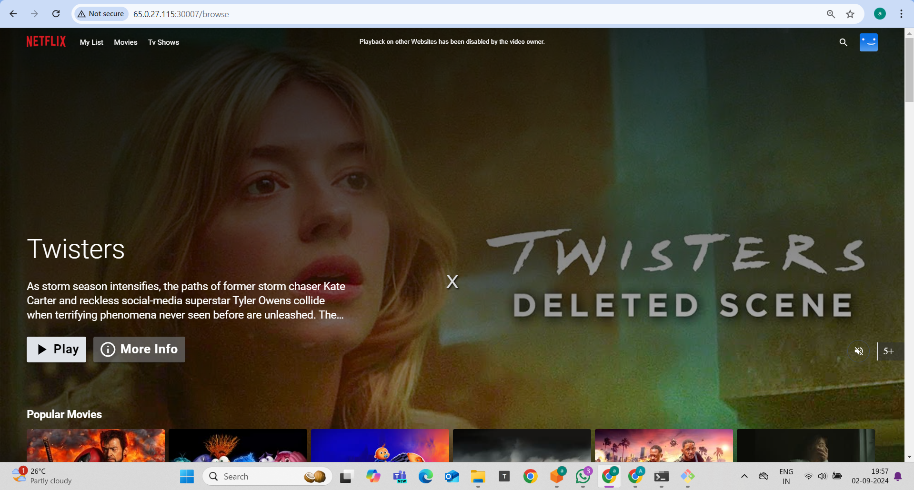
</div>
<br>

<div align="center">
  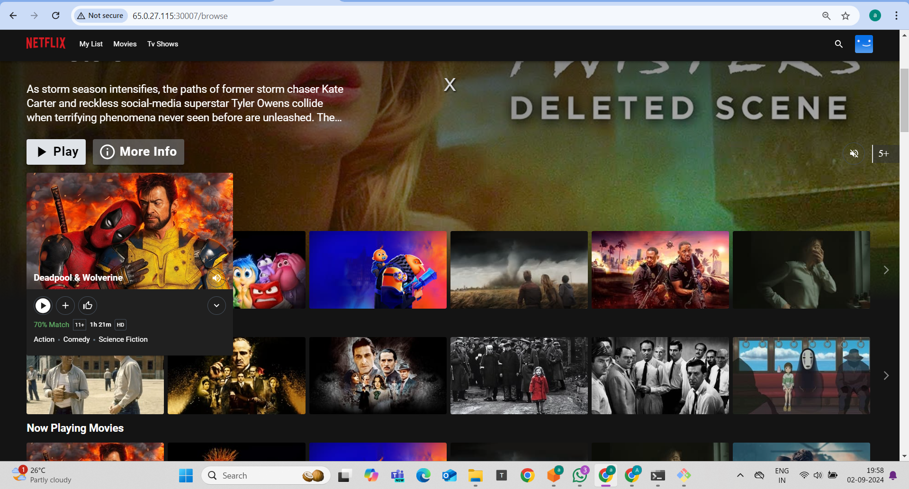
</div>
<br>

<div align="center">
  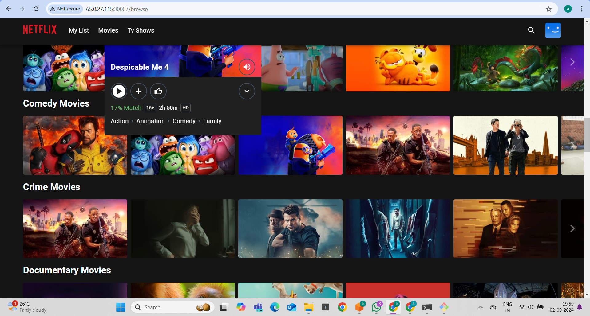
</div>

### Create the Ec2 Instance As shown in below.

<div align="center">
  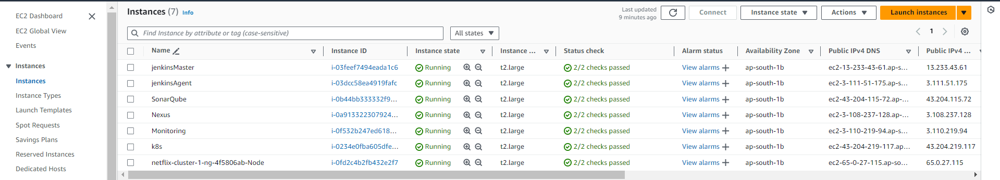
</div>
<br>

### Open the below mentioned port number open as shown in the image.
<div align="center">
  
</div>
<br>

## Installing the Jenkins. (I am here following master nodeagent config.)

1. Create the 2 EC2 instance  ubuntu machine with 15GB memory storage and run the below command on both machine.

```
sudo apt update
sudo apt upgrade -y
```

```
sudo apt update
sudo apt install fontconfig openjdk-17-jre
java -version
openjdk version "17.0.8" 2023-07-18
OpenJDK Runtime Environment (build 17.0.8+7-Debian-1deb12u1)
OpenJDK 64-Bit Server VM (build 17.0.8+7-Debian-1deb12u1, mixed mode, sharing)

#jenkins
sudo wget -O /usr/share/keyrings/jenkins-keyring.asc \
https://pkg.jenkins.io/debian-stable/jenkins.io-2023.key
echo deb [signed-by=/usr/share/keyrings/jenkins-keyring.asc] \
https://pkg.jenkins.io/debian-stable binary/ | sudo tee \
/etc/apt/sources.list.d/jenkins.list > /dev/null
sudo apt-get update
sudo apt-get install jenkins
sudo systemctl start jenkins
sudo systemctl enable jenkins

```

### Install docker on both the machine 
```
sudo apt-get update
sudo apt-get install docker.io -y
sudo usermod -aG docker $USER  # Replace with your system's username, e.g., 'ubuntu'
newgrp docker
sudo chmod 777 /var/run/docker.sock
```

### Install the trivy on NodeAgent jenkins Machine 
```
sudo apt-get install wget apt-transport-https gnupg lsb-release
wget -qO - https://aquasecurity.github.io/trivy-repo/deb/public.key | sudo apt-key add -
echo deb https://aquasecurity.github.io/trivy-repo/deb $(lsb_release -sc) main | sudo tee -a /etc/apt/sources.list.d/trivy.list
sudo apt-get update
sudo apt-get install trivy
```

### To resolve the docker login issue on jenkins pipeline machine, Run the below coomand on the both jenkins machine.
```
sudo usermod -aG docker jenkins
sudo systemctl restart jenkins
```

# To access the masterJenkins Machine 'publicIP:8080'
###### We are doing all operation in master node & all operation run in jenkinsNode.

After this install required plugins for this project.
1. Eclipse
2. docker
3. sonarqube scanner
4. quality gate
5. dependency check (OWASP)
6. prometheus
7. nodejs

----> Restart the jenkins machine after this if required.

#### Add the below mentioned credential in the jenkins machine
<div align="center">
  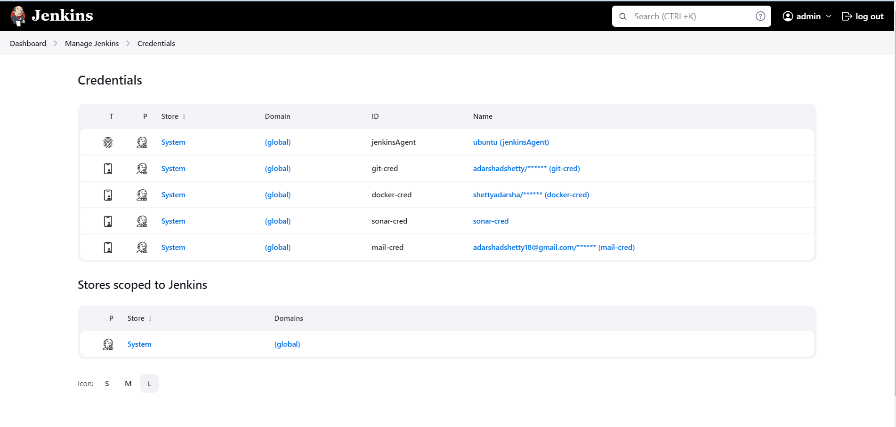
</div>
<br>

### Install the SonarQube machine .
###### Create ubuntu EC2 machine and install the docker on that machine . And Execute the below commnad.
```
docker run -d --name sonar -p 9000:9000 sonarqube:lts-community
```

###### Access this --> PublicIP:9090 and you will get like this. And use 'admin' as a username and password for 1st. And Change to new one.

<div align="center">
  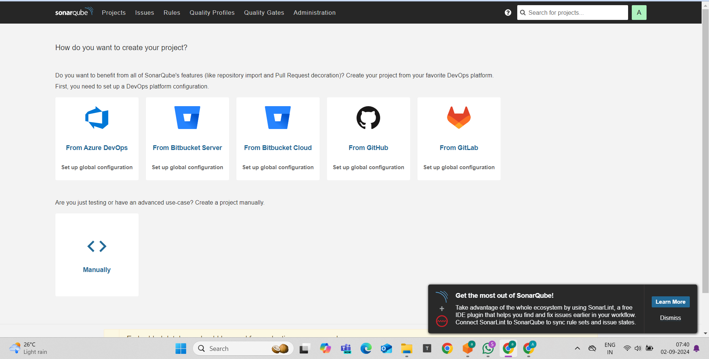
</div>
<br>

---> Here Create a new project named as 'Netflix' and setup it Manual. \
---> And Also create a webhook , 'publicIPJenkins:8080/sonarqube-webhook/' 

### ------------------ Setup Bootstrap Server for eksctl and Setup Kubernetes using eksct----------------------


###### Create a EC2 instance with t2.large machine with 20GB space storage. (ubuntu)

## Install AWS Cli on the above EC2
```
sudo su
curl "https://awscli.amazonaws.com/awscli-exe-linux-x86_64.zip" -o "awscliv2.zip"
apt install unzip,   $ unzip awscliv2.zip
sudo ./aws/install
```

or

```
sudo yum remove -y aws-cli
pip3 install --user awscli
sudo ln -s $HOME/.local/bin/aws /usr/bin/aws
aws --versio
```
##### After this configure the awscli
```
aws configure
```
Give here ,
----> AWS Access_Key : ********************
----> AWS Secret_Key : ********************

## Installing kubectl (Install below CMD 1 By 1)

```
sudo su
curl -O https://s3.us-west-2.amazonaws.com/amazon-eks/1.27.1/2023-04-19/bin/linux/amd64/kubectl
ll
chmod +x ./kubectl  //Gave executable permisions
mv kubectl /bin   //Because all our executable files are in /bin
 kubectl version --output=yaml
```

## Installing  eksctl (Install below CMD 1 By 1)
```
curl --silent --location "https://github.com/weaveworks/eksctl/releases/latest/download/eksctl_$(uname -s)_amd64.tar.gz" | tar xz -C /tmp
cd /tmp
ll
sudo mv /tmp/eksctl /bin
eksctl version
```
## Setup Kubernetes using eksctl
```
 eksctl create cluster --name virtualtechbox-cluster \
--region ap-south-1 \
--node-type t2.large \
--nodes 1 \
```

### Varify !!
```
kubectl get nodes
```

# --------------- Install helm on this machine ----------------------------------

```
curl -fsSL -o get_helm.sh https://raw.githubusercontent.com/helm/helm/main/scripts/get-helm-3
chmod 700 get_helm.sh
./get_helm.sh
```

## Install Node Exporter using Helm.
1. Install Node Exporter using Helm
```
helm repo add prometheus-community https://prometheus-community.github.io/helm-charts
```

2. Create a Kubernetes namespace for the Node Exporter:
```
kubectl create namespace prometheus-node-exporter
```

3.kubectl create namespace prometheus-node-exporter
```
helm install prometheus-node-exporter prometheus-community/prometheus-node-exporter --namespace prometheus-node-exporter
```

#### And check
```
kubectl get svc
```
You will find ns with prometheus.
<div align="center">
  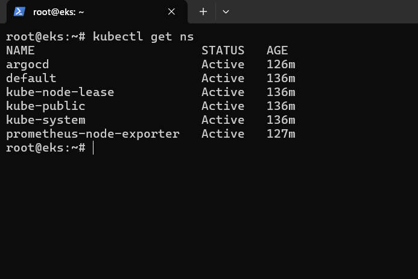
</div>
<br>


<div align="center">
  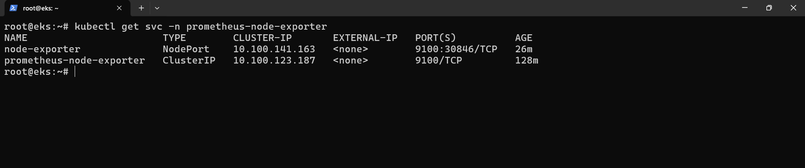
</div>
<br>


or

#### Links to download Prometheus, Node_Exporter & black Box exporter . https://prometheus.io/download/   (Follow this, I am followed this.)


## ========= ArgoCD Installation on EKS Cluster and Add EKS Cluster to ArgoCD ==========

#### Follow this link --> https://archive.eksworkshop.com/intermediate/290_argocd/install/
or 
#### Execute the below command
```
kubectl create namespace argocd
kubectl apply -n argocd -f https://raw.githubusercontent.com/argoproj/argo-cd/v2.4.7/manifests/install.yaml
```

```
kubectl patch svc argocd-server -n argocd -p '{"spec": {"type": "LoadBalancer"}}'
```

Wait about 2 minutes for the LoadBalancer creation


```
export ARGOCD_SERVER=`kubectl get svc argocd-server -n argocd -o json | jq --raw-output '.status.loadBalancer.ingress[0].hostname'`
```

###### You will get argocd URL , copy and paste in chrome 'admin' default username.
```
echo $ARGOCD_SERVER
```

```
export ARGO_PWD=`kubectl -n argocd get secret argocd-initial-admin-secret -o jsonpath="{.data.password}" | base64 -d`
```
###### password for login
```
echo $ARGO_PWD
```
<div align="center">
  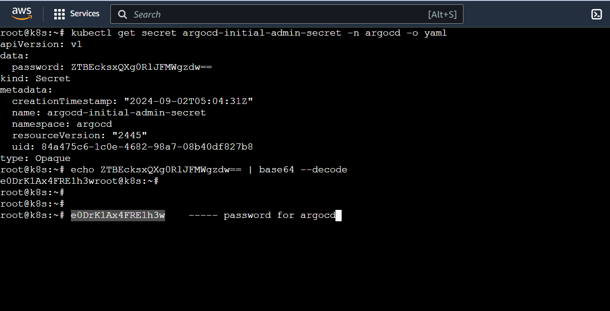
</div>
<br>


# After Login (URL in image)
<div align="center">
  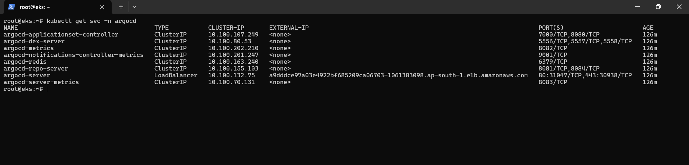
</div>
<br>


###### Use the default cluster
<div align="center">
  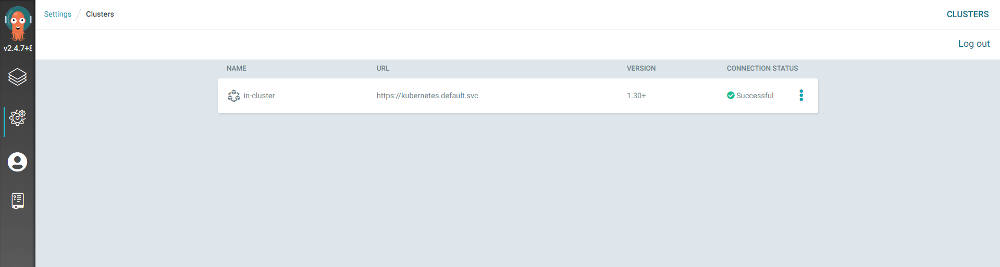
</div>
<br>

###### Use the git repository of your project

<div align="center">
  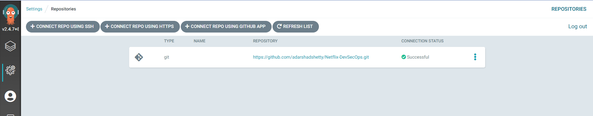
</div>
<br>

###### Create a app with default cluster.

<div align="center">
  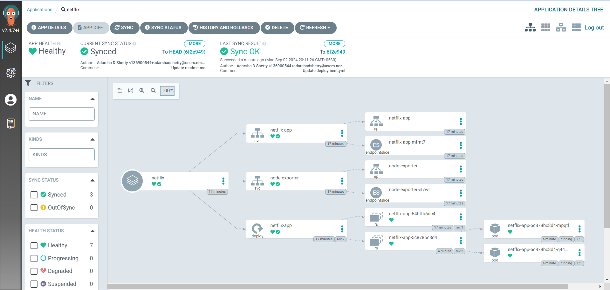
</div>
<br>

#### Sync the app with force after the app synchronized successfully you will get like this.
<div align="center">
  
</div>
<br>

##### App Pulled the latest netflix image from the DockerHub
<div align="center">
  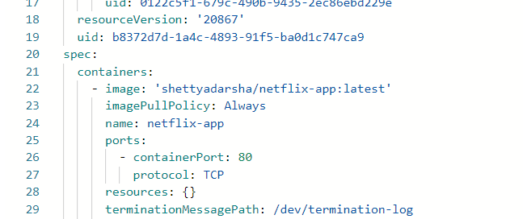
</div>
<br>

<div align="center">
  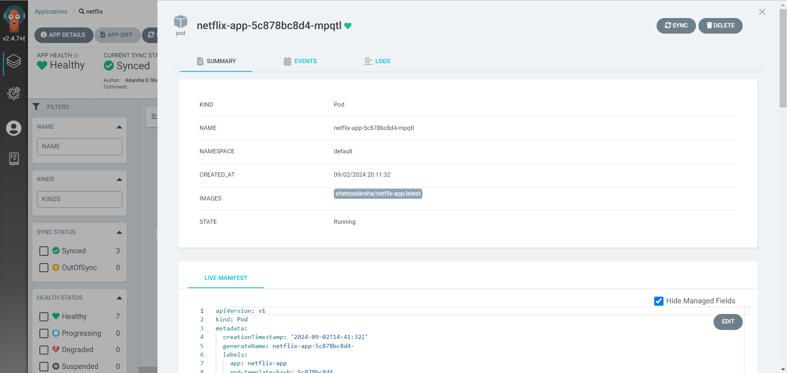
</div>
<br>

### Now You Can Access the application on   'Node1PublicIP:30007'
<div align="center">
  
</div>
<br>


## --------------------------------------------------- Monitoring ----------------------------------------------------------------------------
######  We will collect metrics from Netflix , Jenkins , K8s , and create dashboard in Grafana.

### Create the EC2 t2.large ubuntu machine with 30GB memory storage.
```
sudo apt update
sudo apt upgrade -y
```

###### Links to download Prometheus, Node_Exporter & black Box exporter . https://prometheus.io/download/
###### Links to download Grafana , https://grafana.com/grafana/download
###### Other link from video, https://github.com/prometheus/blackbox_exporter

```
wget https://github.com/prometheus/prometheus/releases/download/v2.54.1/prometheus-2.54.1.linux-amd64.tar.gz
```
```
ls
```
Extract the zip file.
```
tar -xvf prometheus-2.54.1.linux-amd64.tar.gz
```

rm tar file
```
rm prometheus-2.54.1.linux-amd64.tar.gz
```

```
cd prometheus-2.54.1.linux-amd64
```
Execute the .prometheus file to install the prometheus.
```
./prometheus &
```
###### Access the prometheus in 'publicIP:9090'


## Install the Grafana.
```
sudo apt-get install -y adduser libfontconfig1 musl
wget https://dl.grafana.com/enterprise/release/grafana-enterprise_11.2.0_amd64.deb
sudo dpkg -i grafana-enterprise_11.2.0_amd64.deb
```
Install 'musl' if you get Error here.

## Install the BlackBox Exporter
```
wget https://github.com/prometheus/blackbox_exporter/releases/download/v0.25.0/blackbox_exporter-0.25.0.linux-amd64.tar.gz
tar -xvf blackbox_exporter-0.25.0.linux-amd64.tar.gz
rm blackbox_exporter-0.25.0.linux-amd64.tar.gz
cd blackbox_exporter-0.25.0.linux-amd64
./blackbox_exporter
```
###### Access the  BlackBox Exporter in 'publicIP:9115'  (For Application Netflix & prometheus.io)

## Install the Node_Exporter in Jenkins Server Machine.
```
wget https://github.com/prometheus/node_exporter/releases/download/v1.8.2/node_exporter-1.8.2.linux-amd64.tar.gz
tar -xvf node_exporter-1.8.2.linux-amd64.tar.gz
rm node_exporter-1.8.2.linux-amd64.tar.gz
cd node_exporter-1.8.2.linux-amd64
./node_exporter
```
###### Access the  Node_Exporter in 'publicIP:9100'

#### Add the job to a prometheus
```
sudo nano prometheus-2.54.1.linux-amd64/prometheus.yml 
```
Add job like this.
<div align="center">
  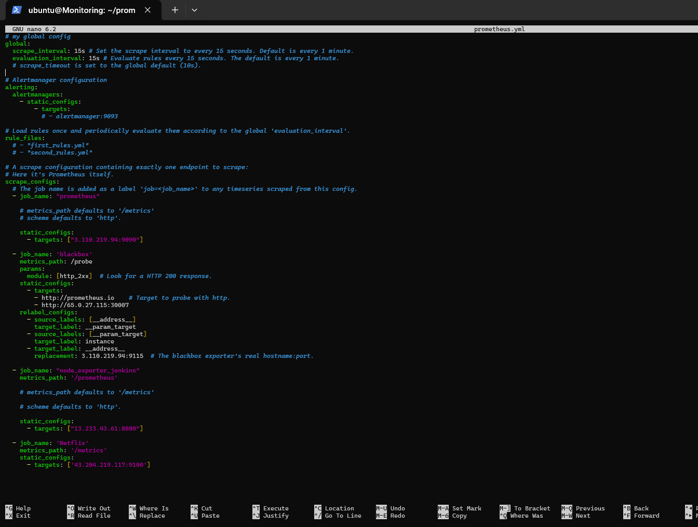
</div>
<br>

```
pgrep prometheus
```
```
kill 2314   # 2314 is process id
```
```
./prometheus &
```

### Now refresh Your prometheus. After it looks like this.
<div align="center">
  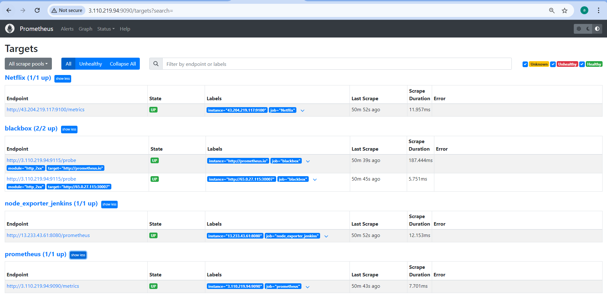
</div>
<br>

# ----------------------------------------------------- Grafana SetUp -------------------------------------------------------------
### Login to the Grafana  'publicIP:3000' and use 'admin' as the password and username. Change to a new one.
#### Import the Grafana Dashboard for the following 
1. Jenkins: Performance and Health Overview
2. Node Exporter Full  for jenkins
3. Prometheus Blackbox Exporter  for prometheus and Netflix

   Dashaboard --> Import dashbord --> In ID section give the respective dashbord id.
   1. Jenkins: Performance and Health Overview   --->  9964
   2. Node Exporter Full                         --->  1860
   3. Prometheus Blackbox Exporter               --->  7587
  

###### Give DataSource as Prometheus in Grafana. It will take data from prometheus for generating graph.
<div align="center">
  
</div>
<br>
<div align="center">
  
</div>
<br>
<div align="center">
  
</div>
<br>
<div align="center">
  
</div>
<br>
<div align="center">
  
</div>
<br>
<div align="center">
  
</div>
<br>


