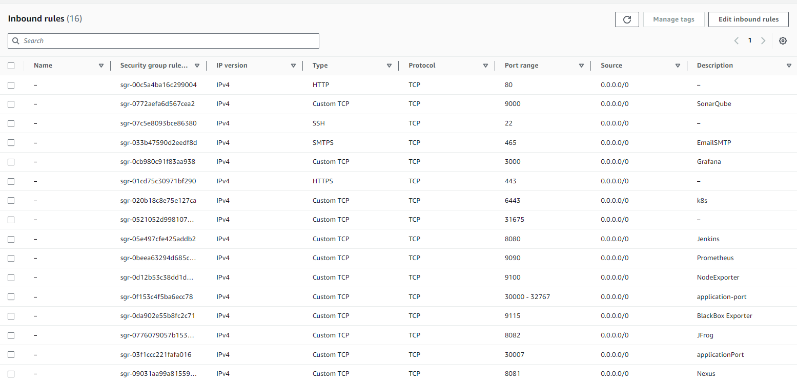

# Netflix Application Deployment.  (DevSecOps-Project)

  

 

  

 

  

### Create the Ec2 Instance As shown in below.

  

 

### Open the below mentioned port number open as shown in the image.

  

 
